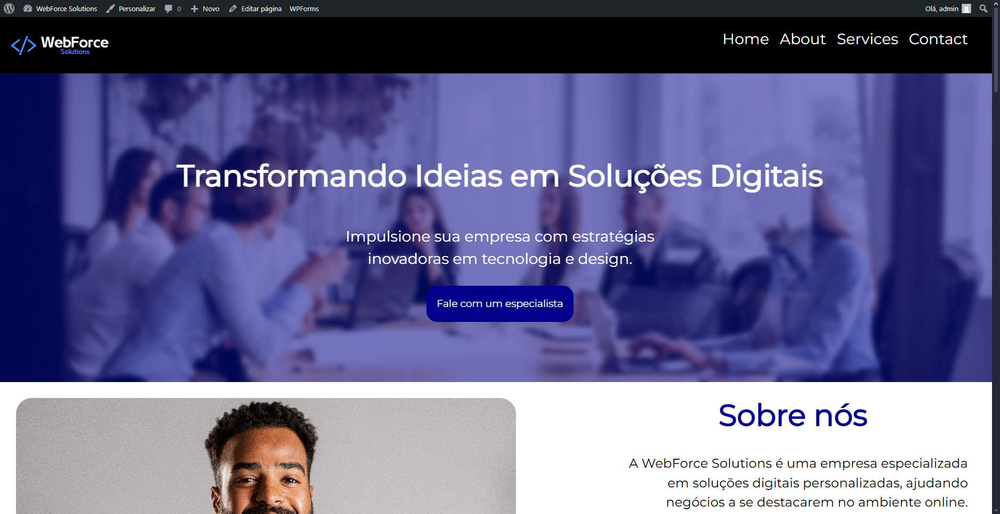

# Darkside Theme - WebForce Solutions

Este é um tema WordPress personalizado desenvolvido para representar o site institucional de uma **empresa fictícia chamada WebForce Solutions**.
> Este tema foi desenvolvido com base no [Underscores Starter Theme](https://underscores.me/), que serviu como fundação para estrutura inicial do WordPress.
---

## 🛠️ Tecnologias utilizadas

- PHP
- WordPress
- HTML5
- CSS3
- JavaScript (fetch)
- [ACF - Advanced Custom Fields](https://www.advancedcustomfields.com/)- 
- [WPForms](https://wpforms.com/) (formulário de contato)
- [Underscores Starter Theme](https://underscores.me/),

---

## 📁 Estrutura do Tema

A estrutura do tema segue a organização abaixo:

- darkside-theme/
- ├── acf/   # Exportação dos campos ACF (1 arquivo JSON)
- ├── assets/ 
- │ ├── css/   # Arquivos css
- │ ├── images/
- │ ├── fonts/
- ├── template-parts/   # Seções reutilizáveis
- │ ├── hero.php
- │ ├── sobre.php
- │ ├── servicos.php
- │ ├── contato.php
- │ ├── noticias.php
- │ └── history.php
- ├── front-page.php   # Página inicial com seções
- ├── page-history.php   # Página personalizada com a história da empresa
- ├── functions.php
- ├── header.php
- ├── footer.php
- ├── style.css
- └── ...       #Arquivos gerados pelo o Underscores Starter Theme

---

## ⚙️ Funcionalidades implementadas

- Página inicial personalizada (`front-page.php`) com seções:
  - Hero
  - Sobre
  - Serviços
  - Contato
  - Noticias
- Página estática separada (`page-history.php`) para contar a história da empresa
- Campos personalizados com ACF
- Modularização com `get_template_part()`
- Integração com API externa para exibir notícias (via `fetch`)
- Estilo visual moderno com tons escuros e tipografia responsiva
- Organização de branches Git (main, dev, features)
- Formulário de contato funcional com WPForms (inserido via shortcode)
- Integração com WP Mail SMTP para garantir o envio correto dos e-mails do formulário

---

## 💻 Como instalar e rodar localmente

1. Clone o repositório ou copie a pasta `darkside-theme` para:
   seu-projeto/wp-content/themes/

2. No painel do WordPress:
   - Vá até **Aparência > Temas**
   - Ative o tema **Darkside Theme**

3. Configure a página inicial:
   - Vá em **Configurações > Leitura**
   - Selecione **“Uma página estática”**
   - Escolha uma página para ser a **página inicial** (ex: "Home")

---

## 📦 Importar os campos ACF

Os campos personalizados utilizados no tema foram exportados via JSON.

### 📁 Caminho:

- acf/group_webforce_campos.json

### 📥 Para importar:

1. Vá em **ACF > Ferramentas**
2. Clique em **Importar JSON**
3. Selecione o arquivo `.json` da pasta `acf`
4. Clique em **Importar grupo de campos**

---

## 🌐 Integração com API externa

O tema realiza uma requisição via `fetch()` para uma **API de notícias externa**, exibindo dinamicamente conteúdos com base no tema do site.

---

## 📸 Screenshot

---

## 👤 Autor

**Pedro Henrique**  
GitHub: [@PedroFialhoo](https://github.com/PedroFialhoo)
LinkedIn: [linkedin.com/in/pedro-henrique-bittencourt-fialho-2024142b5](https://www.linkedin.com/in/pedro-henrique-bittencourt-fialho-2024142b5)

---
